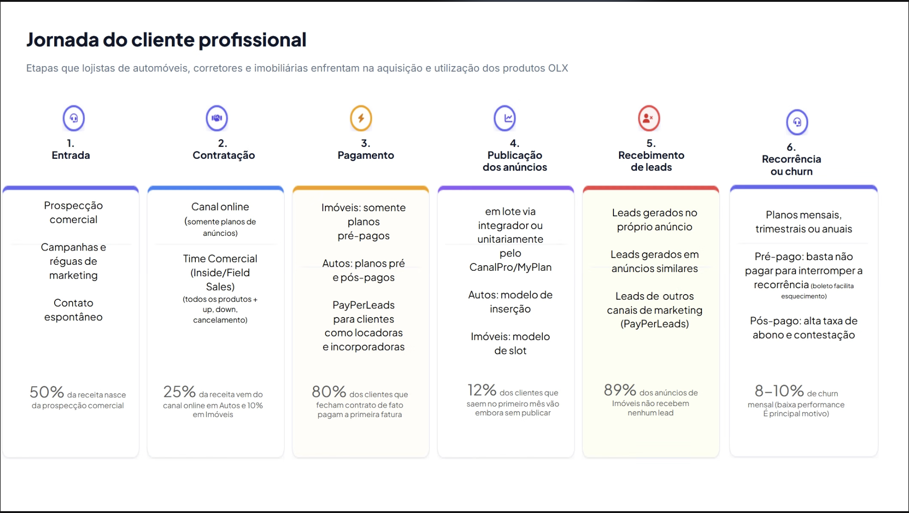

# Originais recebidos do cliente

Material bruto que veio do **data room do Grupo OLX** (Google Drive). Nada aqui é produzido pela V4:
é insumo, e o que a V4 escreve sobre ele vive em `02-diagnostico/`.

> ⚠️ **Confidencial.** Cobre o aviso das comunicações da OLX e a cláusula 5.3 do contrato. Não sai
> deste repositório privado, não vai para serviço externo, não entra em material que circule fora do
> projeto sem autorização escrita.

## Procedência

| Item | Detalhe |
|---|---|
| Origem | Data room do Grupo OLX, Google Drive |
| Baixado em | 24/08/2026 |
| Conta usada | `rafael.corazza-ext@olxbr.com`, a conta de domínio OLX liberada no mesmo dia |
| Lote | `drive-download-20260824T172625Z-1-003` |
| Volume | 9 arquivos, 457 MB no original (14 MB versionados, ver abaixo) |

> Nem tudo aqui veio desse lote. O material do **bloco A** foi apresentado em reunião e capturado
> da tela, não baixado do Drive — a procedência de cada item está na seção do seu bloco.

Este é o **primeiro lote** que efetivamente abriu com a conta corporativa nova. Ele confirma que o
data room está acessível: o item ficou aberto em `dados/acessos.json` até aqui e agora está fechado.

## Como está organizado

Uma pasta por bloco do [checklist de dados](../../02-diagnostico/checklist-dados-e-acessos.md), com
a mesma letra que o Grupo OLX usa no Drive. Os nomes foram passados para minúsculas sem acento e sem
espaço, porque acento em nome de arquivo quebra entre macOS e Linux dentro do git. O caminho original
de cada arquivo está registrado nas tabelas abaixo, então nada se perde.

```
assets/originais/
├── A-visao-de-negocio-e-fluxo-de-receita/  bloco A · alimenta o fluxo de receita
├── E-criativos-ads-e-mensagens/     bloco E · alimenta o diagnóstico (iv)
├── I-paginas-de-captura/            bloco I · alimenta o diagnóstico (viii)
└── _masters/                        vídeos originais · FORA do git
```

### Proxy no git, master fora

Os 8 vídeos vieram como **masters de finalização**: clipes de 10 segundos exportados a 30–51 Mbps,
455 MB no total. Isso não cabe num repositório de documentação que pesa menos de 1 MB, e todo mundo
que clonasse pagaria esse peso para sempre.

Então o que está versionado nos caminhos acima é um **proxy H.264 CRF 23**, 14 MB no total, que é
mais que suficiente para avaliar criativo, mensagem, ritmo e legibilidade de CTA. O master fica em
`_masters/`, bloqueado pelo `.gitignore`, na máquina de quem baixou, e continua no data room da OLX,
que é a fonte canônica. O SHA-256 de cada master está na tabela de integridade no fim deste arquivo,
então dá para provar que o original é o mesmo quando alguém for buscá-lo.

**Se precisar do master** (remontagem, análise quadro a quadro, entrega para produção): baixe do data
room ou peça a quem tem `_masters/` local. Não recomprima a partir do proxy.

---

## Bloco A · Visão de negócio e fluxo de receita

**Item:** jornada do cliente profissional, o mapa em 6 etapas que o Grupo OLX apresentou.
**Cobre:** o item **A2** do checklist, *parcialmente* — dá as etapas e uma taxa por etapa, não dá
volume absoluto nem série de 12–24 meses.

| Arquivo | O que é | Origem |
|---|---|---|
| `A-visao-de-negocio-e-fluxo-de-receita/jornada-do-cliente-profissional.png` | Slide "Jornada do cliente profissional", 1978×1118 | Apresentado pelo Grupo OLX na sessão de jornada de **28/08/2026**, capturado da tela |



Este é o primeiro material do cliente que traz **taxa por etapa do fluxo**. A leitura, o que ele
fecha e as sete ambiguidades que ele abre estão em
[`02-diagnostico/jornada-do-cliente-profissional.md`](../../02-diagnostico/jornada-do-cliente-profissional.md).

> Os seis percentuais do slide são **declarados**, não apurados. Não viram dado antes de bater
> contra CRM, faturamento e plataformas.

## Bloco E · Criativos, anúncios e mensagens

**Campanha:** Mês do Corretor 2026, peças de consideração, praça São Paulo, unidade RE (imóveis).
**Cobre:** item **E1** do checklist, *parcialmente*. São 8 peças de uma campanha, não a biblioteca
de 6 a 12 meses que foi pedida.

| Arquivo | Formato | Duração | Master | Proxy no git | Bitrate do master |
|---|---|---|---|---|---|
| `v1/1200x628-com-cta.mp4` | 1200x628 | 10s | 38 MB | 1.08 MB | 30.5 Mbps |
| `v2/1080x1080-com-cta.mp4` | 1080x1080 | 10s | 60 MB | 1.54 MB | 47.6 Mbps |
| `v2/1080x1920-com-cta.mp4` | 1080x1920 | 10s | 64 MB | 1.79 MB | 51.4 Mbps |
| `v2/1080x1920-sem-cta.mp4` | 1080x1920 | 10s | 64 MB | 1.78 MB | 51.4 Mbps |
| `v3/1080x1080-com-cta.mp4` | 1080x1080 | 10s | 58 MB | 1.48 MB | 46.8 Mbps |
| `v3/1080x1920-com-cta.mp4` | 1080x1920 | 10s | 64 MB | 1.74 MB | 51.0 Mbps |
| `v3/1080x1920-sem-cta.mp4` | 1080x1920 | 10s | 63 MB | 1.72 MB | 50.8 Mbps |
| `v3/1200x628-com-cta.mp4` | 1200x628 | 10s | 43 MB | 1.09 MB | 34.6 Mbps |
| **Total** | | | **455 MB** | **14 MB** | |


*Quadro final de V1 (1200x628), V2 e V3 (1080x1920), extraído dos próprios arquivos.*

### O que a campanha comunica

Comum às três variantes: oferta **"Até 40% OFF nos planos profissionais"**, CTA **"Saiba mais"**,
prova **"+1,8 milhões de leads/mês em SP"** e assinatura conjunta grupo OLX · Zap · VivaReal · OLX.

O que muda é o ângulo da mensagem, e são três ângulos distintos:

| Variante | Pessoa em cena | Promessa |
|---|---|---|
| V1 | corretora, ambiente de escritório | "Quem é especialista está **onde os negócios acontecem**" |
| V2 | corretor, ambiente de escritório | "Quem entende do mercado **faz negócios aqui**" |
| V3 | **Mônica Poplawski**, nomeada em tela | "**Leads qualificados** pra você focar em fechar uma venda ou locação" |

V1 e V2 são a mesma ideia (pertencimento e status) com elenco diferente. V3 muda de eixo: sai de
status e vai para benefício funcional, com prova social de uma pessoa nomeada. Para o diagnóstico
(iv) isso importa, porque é a única das três que promete **qualificação de lead**, que é exatamente
o terreno das travas de Qualificação e Compromisso.

### Quatro achados para o diagnóstico (iv)

1. **A oferta chega no segundo 5, o CTA no segundo 7, em peça de 10 segundos.** Contei quadro a
   quadro: 0s ambiente vazio, 1s marca, 3s título, 4s subtítulo, 5s a oferta de 40% OFF, 7s o botão
   "Saiba mais". Em feed e em Reels, a maior parte da audiência já saiu antes do segundo 5. A peça
   guarda o argumento comercial para o final, e o final quase ninguém vê.
2. **São masters, não peças de veiculação.** 10 segundos a 30–51 Mbps é exportação de finalização.
   O Meta reencoda para algo na casa de 8 a 12 Mbps de qualquer forma. Não é problema de
   performance, mas indica que o que circula entre os times é o arquivo pesado, e não um pacote de
   entrega organizado por formato.
3. **Nenhuma das 8 tem faixa de áudio.** Para consideração em feed é escolha defensável. Para 9x16
   em Reels e Stories, onde o som está ligado na maioria das sessões, é lacuna a checar: a peça
   compete no som com quem tem som.
4. **A matriz de formatos está incompleta.** V1 só existe em 1200x628. V2 tem 1x1 e 9x16. Só a V3
   tem os três. Se as três foram para o ar juntas, elas não disputaram os mesmos posicionamentos, e
   qualquer leitura de "qual criativo performou melhor" está contaminada por isso, não por
   criatividade.

> 💡 Isto aqui é **B2B de verdade**: corretor, plano profissional, leads. Vale contrapor à
> [PENDENCIA 12](../../PENDENCIAS.md), que registra que as campanhas visíveis no Google Ads parecem
> ser B2C. Ou o B2B vive em outra conta, ou vive só no Meta. É pergunta para o kick-off.

**O que ainda falta no bloco E:** E2 (brandbook, diretrizes de marca, messaging house) e E3
(briefings das campanhas). Sem E3 não dá para saber se V1, V2 e V3 eram um teste de mensagem
deliberado ou três entregas soltas da agência, e essa distinção muda a leitura inteira.

---

## Bloco I · Páginas de captura e fluxos de conversão

**Cobre:** item **I3** do checklist, histórico de testes A/B.

| Arquivo | Tipo | Peso |
|---|---|---|
| `teste-ab-imoveis/2026-03-teste-ab-lp-anuncie-zap.pptx` | PowerPoint, 8 slides | 2.3 MB |

**Teste A/B: LP Anuncie ZAP**, de 17/03 a 23/03. Resultado declarado no material:

| Campo | Valor declarado |
|---|---|
| Vencedora | Variante A |
| Ganho | 54,3% em eficiência de conversão por visitante único |
| Confiança | 99,93%, p-valor 0,0007 |
| Eficiência em MQL | Variante A 1,5x a Variante B |
| Engajamento | 1,58 sessões por visitante na A contra 1,25 na B |
| Objetivo da LP | Gerar MQL para o comercial vender plano profissional a novo anunciante |
| Mudança testada | Formulário reposicionado, texto hero em mais destaque |
| Recomendação do material | Pausar a B e mandar 100% do tráfego para a A |

> ⚠️ **Os números acima são declaração do cliente, não achado da V4.** Vão para o diagnóstico como
> insumo e precisam de verificação antes de sustentar qualquer decisão: o material não traz volume
> absoluto de visitantes nem de MQL, e sem denominador não dá para recalcular a significância. Um
> teste de 7 dias também atravessa uma única semana, o que não isola efeito de dia da semana.
> Cobrar os dados brutos é item para o kick-off.

**O que ainda falta no bloco I:** I1 (URLs das LPs e fluxos ativos), I2 (taxa de conversão por
página e etapa) e I4 (ferramenta de comportamento).

---

## Integridade

SHA-256 de cada arquivo no momento em que entrou no repositório, e o caminho exato de onde veio no
Drive. Serve para provar que o arquivo não mudou e para reencontrar a origem.

| Arquivo | SHA-256 | Caminho no data room |
|---|---|---|
| `E-criativos-ads-e-mensagens/mes-do-corretor-2026-sp-consideracao/v1/1200x628-com-cta.mp4` | `af934723a2c22b69…` | `E. Criativos Ads & Mensagens/Peças/RE/Mês do Corretor 2026/Mês do Corretor _ Peças consideração SP/Motion/V1/1200x628 com CTA.mp4` |
| `E-criativos-ads-e-mensagens/mes-do-corretor-2026-sp-consideracao/v2/1080x1080-com-cta.mp4` | `4450a3335d1cbccb…` | `E. Criativos Ads & Mensagens/Peças/RE/Mês do Corretor 2026/Mês do Corretor _ Peças consideração SP/Motion/V2/1080x1080 com CTA.mp4` |
| `E-criativos-ads-e-mensagens/mes-do-corretor-2026-sp-consideracao/v2/1080x1920-com-cta.mp4` | `3dbded8945745610…` | `E. Criativos Ads & Mensagens/Peças/RE/Mês do Corretor 2026/Mês do Corretor _ Peças consideração SP/Motion/V2/1080x1920 com CTA.mp4` |
| `E-criativos-ads-e-mensagens/mes-do-corretor-2026-sp-consideracao/v2/1080x1920-sem-cta.mp4` | `92c60df7c21afa76…` | `E. Criativos Ads & Mensagens/Peças/RE/Mês do Corretor 2026/Mês do Corretor _ Peças consideração SP/Motion/V2/1080x1920.mp4` |
| `E-criativos-ads-e-mensagens/mes-do-corretor-2026-sp-consideracao/v3/1080x1080-com-cta.mp4` | `c77ac9761976a67b…` | `E. Criativos Ads & Mensagens/Peças/RE/Mês do Corretor 2026/Mês do Corretor _ Peças consideração SP/Motion/V3/1080x1080 com CTA.mp4` |
| `E-criativos-ads-e-mensagens/mes-do-corretor-2026-sp-consideracao/v3/1080x1920-com-cta.mp4` | `f21279362e6e4860…` | `E. Criativos Ads & Mensagens/Peças/RE/Mês do Corretor 2026/Mês do Corretor _ Peças consideração SP/Motion/V3/1080x1920 com CTA.mp4` |
| `E-criativos-ads-e-mensagens/mes-do-corretor-2026-sp-consideracao/v3/1080x1920-sem-cta.mp4` | `02bbcfef42672a26…` | `E. Criativos Ads & Mensagens/Peças/RE/Mês do Corretor 2026/Mês do Corretor _ Peças consideração SP/Motion/V3/1080x1920.mp4` |
| `E-criativos-ads-e-mensagens/mes-do-corretor-2026-sp-consideracao/v3/1200x628-com-cta.mp4` | `2284356e512da371…` | `E. Criativos Ads & Mensagens/Peças/RE/Mês do Corretor 2026/Mês do Corretor _ Peças consideração SP/Motion/V3/1200x628 com CTA.mp4` |
| `A-visao-de-negocio-e-fluxo-de-receita/jornada-do-cliente-profissional.png` | `fb8d738564bb2b10…` | não veio do data room — captura de tela da apresentação de 28/08 |
| `I-paginas-de-captura/teste-ab-imoveis/2026-03-teste-ab-lp-anuncie-zap.pptx` | `4f7c85fe6821206d…` | `I. Páginas de Captura e Fluxos de Conversão/Testes a-b imóveis/Copy of A_B Test Results - Landing Page_.pptx` |

